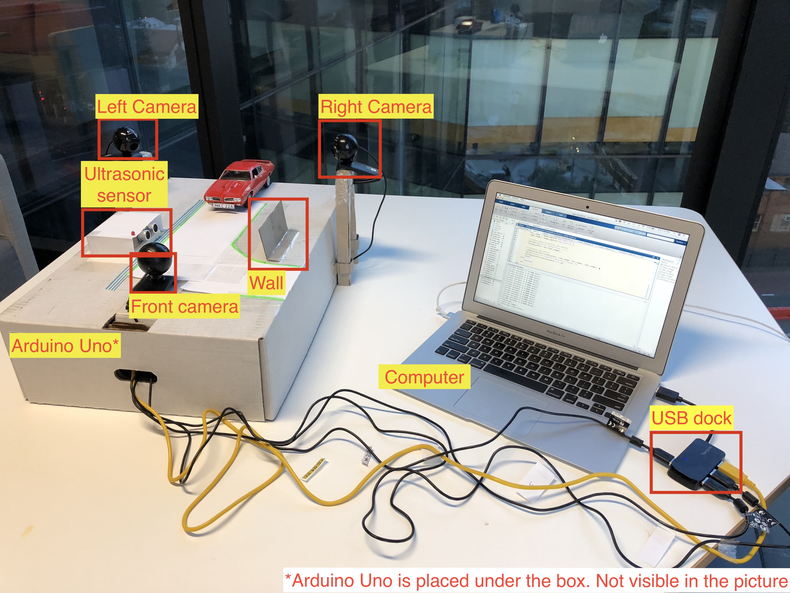

# An Automatic Visual Inspection System of a Car

This project is a preliminary stage of the automatic inspection of a car entering a garage. The primary aim of this project is to develop a system to automatically recognise the license plate number, create a database of the car and store the images of the car for further processing. The project is developed in MATLAB. This project uses a statistical method with a template matching approach to recognising the characters of the license plate of a car.

The code and templates are fine-tuned to detect the text on the car license plates of NSW state of Australia in a controlled environment.



### Essential components

* Arduino micro-controller
* Three USB web cameras
* Ultrasonic sensor
* Bread board
* USB docking port
* Jumper wire, LEDs
* Model car

### MATLAB Add-ons

* [Image Processing Toolbox](https://au.mathworks.com/products/image-processing-toolbox.html?adobe_mc_ref=https%3A%2F%2Fwww.google.com.au%2F&requestedDomain=)
* [Computer Vision System Toolbox](https://au.mathworks.com/products/computer-vision.html)
* [MATLAB support package for Arduino Hardware](https://www.mathworks.com/hardware-support/arduino-matlab.html)
* [HC-SR04 Add-On Library for Arduino](https://au.mathworks.com/matlabcentral/fileexchange/57898-hc-sr04-add-on-library-for-arduino)

### How to run

Connect the LED to Arduino pin D11. Connect the ultrasonic sensor Trig pin to D12 and Echo to D13. Connect the camera modules to USB docking port or your computer USB ports (if available in plenty) for the input image from the cameras. Make a note about the connection of your USB camera and always test the cameras before functioning.
For more information on Ultrasonic Sensor connections, click [here](https://au.mathworks.com/examples/matlab/community/34660-control-hc-sr04-ultrasonic-sensor).

Type ```webcamlist``` in the command window to check out the name of the USB cameras as detected by the computer. Then use the following lines to test the webcams.
```
cam = webcam('Logitech')
preview(cam)
```
After the hardware configuration, run the ```main.m``` file to conduct the experiment.


To input a single image to detect the text on the license plate of the car, use the following line of code in the MATLAB command window.
```
Image = imread('car_image_file.jpg');
npr(Image)
```
